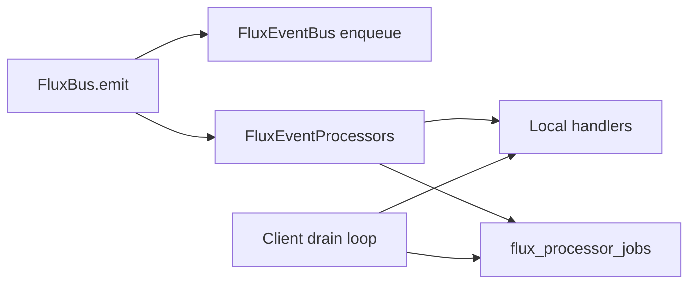

# P7-EVENT-BUS

**Step ID:** `P7-EVENT-BUS`  
**Flag:** `enable_event_bus_processors` (default **off**)

Builds on **P1-EVENTS-SKELETON** (`enable_event_bus` for `flux_product_events` persistence). Processors can run with or without server telemetry writes.

## What shipped

| Piece | Location |
|-------|----------|
| Server queue | `public.flux_processor_jobs` |
| RPCs | `flux_enqueue_processor_jobs`, `flux_claim_processor_jobs`, `flux_complete_processor_job` |
| Client | `public/js/flux-event-processors.js` |
| Styles | `public/css/flux-event-processors.css` (debug panel hooks) |
| Migration | `supabase/migrations/20260525400000_event_bus_processors.sql` |

## Architecture



### Built-in processors

| ID | Events | Behavior |
|----|--------|----------|
| `audit_ring` | `*` | Last 40 event names in `localStorage` (no titles/PII) |
| `session_rollup` | `session_ended` | Local session counters |
| `momentum_hint` | `task_completed` | Emits `processor_momentum_hint` (internal bus) |
| `server_relay` | `task_completed`, `session_ended`, `momentum_update` | Enqueues server jobs for edge drain |

Server jobs are claimed by the signed-in client every ~45s (`flux_claim_processor_jobs` → handlers → `flux_complete_processor_job`). A future Supabase Edge Function can use the same RPCs with a service role.

## Enable (dev)

```javascript
window.FLUX_EXPERIMENTS = {
  enable_event_bus_processors: true,
  enable_event_bus: true, // optional — product_events persistence
};
await FluxFeatureFlags.load({ force: true });
FluxEventBus.install();
FluxEventProcessors.install();
```

Inspect:

```javascript
FluxEventProcessors.getAuditRing();
FluxEventProcessors.getSessionStats();
FluxBus.processorStats();
```

```sql
SELECT event_name, status, created_at
FROM flux_processor_jobs
WHERE user_id = auth.uid()
ORDER BY created_at DESC
LIMIT 20;
```

## Custom processors

```javascript
FluxEventProcessors.registerProcessor('task_completed', async (payload, ctx) => {
  // idempotent side effect
}, { id: 'my_feature', priority: 30 });
```

## Rollback

1. Set `enable_event_bus_processors` false (default).  
2. `FluxEventProcessors.uninstall()` on next sign-in path is automatic when flag off.  
3. Pending jobs remain in `flux_processor_jobs`; safe to leave or purge via migration.

## Out of scope (later steps)

- Supabase Edge Function worker deployment  
- Cross-user analytics on processor runs  
- `P7-AI-ORCH` multi-agent orchestration
